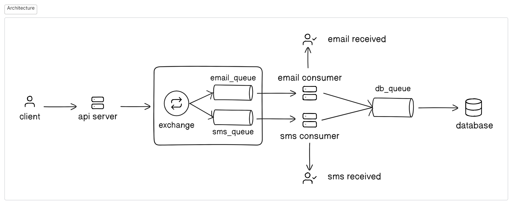

# Multi-channel notification delivery system

Server/Client triggers sending notification by calling the API service and providing relevant data like type of notification to send (eg email/sms/push etc.), email/phone number, body, etc. These tasks are then pushed by the API service to the exchange which gets routed to relevant queue according to its message type. These tasks are consumed by their respective services and notifications are sent to end users. After which a copy of the task along with its status (success/failure) is saved in the database through a different message queue. This is a highly customizable and scalable infrastructure where new notification channels can be easily added.



## Running Locally

To run locally make sure you have **Node.js, RabbitMQ and MongoDB** installed in your system.

- Clone the project locally

- On different terminal windows, cd into api-service, email-service, sms-service, database

- On each terminal window run

  ```bash
  npm run start
  ```

- Using Postman send a **POST** request to **localhost:3000** with the following JSON body
  ```json
  {
    "type": "email",
    "to": "name@example.com",
    "subject": "Notification System Test",
    "body": "it works!"
  }
  ```

\
_Note: - Email service is fully functional_
